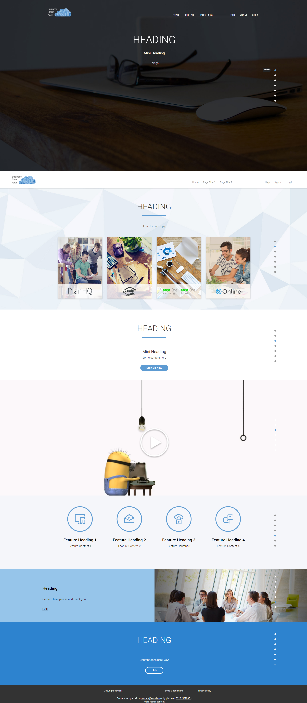

Demo Site
==============

**NOTE TO FUTURE ASHLEIGH**
Add extra product pages and help site page, and deleted files that are not used in this version (that were from master branch, i.e. php pages and general Wordpress stuff)


Introduction
------------

For my first professional solo project in around October 2015, I was given a design for a demo site that is now shown to clients at my current company to showcase the kind of sites we can develop.

It was built using HTML5, JQuery, SASS, and the content was originally intended to be hardcoded.

As it was a Wordpress site, and I finished sooner than the deadline, I decided to utilise the Wordpress PHP functions to instead insert content from Wordpress posts into the correct places on the pages (depending on their tags and categories, thanks to the Content Part plugin!) so that the content was no longer hardcoded, and all you needed to do was a login to change the content; the code for this can be viewed on the 'master' branch.

The 'master' branch is hosted on demo.bcsg.com, which this has since become private, and therefore not viewable unless you have a password!

For portfolio purposes, I wanted to host this for free, so have done so on Heroku at ashleigh-company-demo-site.herokuapp.com. Because of this, I've created a separate branch 'local-site' and taken out the PHP and replaced it with hardcoded content so the site is still viewable.

The design itself includes parallax scrolling effects, clickable navigation buttons that scroll smoothly all over the homepage and also change colour depending on the module that they're in (that took a while to perfect!), a video module that enlarges to play and closes to pause when you click on it, swipe-able testimonials in mobile, a swipe-able mobile navigation bar and is responsive.

This is the first full project I have worked on by myself, and I can see looking back that there is a lot that can be improved, mainly with regards to refactoring and improving general site performance!


Set up Locally
--------------

In the terminal, navigate to the directory you want to save this project to.

Clone the project:

```
$ git clone https://ashleighmaund@bitbucket.org/ashleighmaundcode/db-homepage.git
```

**For the hardcoded content version, checkout the local-site branch:**

```
$ git fetch
$ git checkout local-site
```

Install the dependencies:

```
$ npm install
```

Build the .js and .css files:

```
$ grunt
```

To run a local server and view the app:

```
$ npm start
```

Then go to localhost:5000 in the browser and have a look around.


Homepage Screenshot
-------------------

